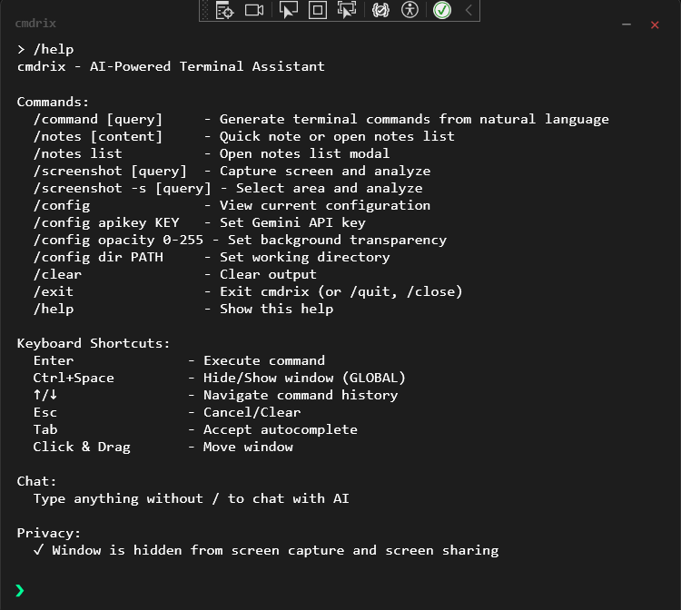

# cmdrix

**cmdrix** is an AI-powered terminal assistant that brings natural language command generation, note-taking, and screenshot analysis to your Windows desktop. Built with WPF and powered by Google Gemini AI.



## ✨ Features

- **🤖 Natural Language to Commands**: Describe what you want in plain English, get the right terminal command
- **📝 Quick Notes**: Capture thoughts instantly with a built-in note management system
- **📸 Screenshot Analysis**: Take screenshots and ask AI questions about them
- **💬 AI Chat**: Direct conversation with Gemini AI for general queries
- **⌨️ Smart Autocomplete**: Tab completion and command suggestions
- **🎨 Customizable UI**: Adjustable opacity and modern dark theme
- **⚡ Global Hotkey**: Toggle visibility with `Ctrl+Space`
- **🔒 Safety Preview**: Review dangerous commands before execution

## 🚀 Getting Started

### Prerequisites

- Windows 10/11
- .NET 6.0 or later
- Google Gemini API key ([Get one here](https://makersuite.google.com/app/apikey))

### Installation

1. Clone the repository:
```bash
git clone https://github.com/bapunhansdah/cmdrix.git
cd cmdrix
```

2. Build the project:
```bash
dotnet build
```

3. Run cmdrix:
```bash
dotnet run
```

4. Set your API key:
```
/config apikey YOUR_GEMINI_API_KEY
```

## 📖 Usage

### Commands

| Command | Description |
|---------|-------------|
| `/command [query]` | Generate terminal commands from natural language |
| `/notes [content]` | Quick note creation or open notes list |
| `/notes list` | Open notes management modal |
| `/screenshot [query]` | Capture screen and analyze with AI |
| `/config` | View current configuration |
| `/config apikey KEY` | Set your Gemini API key |
| `/config opacity 0-255` | Adjust window transparency |
| `/config dir PATH` | Set working directory |
| `/clear` | Clear output history |
| `/help` | Show help information |
| `/exit` | Exit cmdrix |

### Keyboard Shortcuts

- `Enter` - Execute command
- `Ctrl+Space` - Hide/Show window (global)
- `↑/↓` - Navigate command history
- `Esc` - Cancel/Clear
- `Tab` - Accept autocomplete suggestion
- `Click & Drag` - Move window

### Examples

**Generate Commands:**
```
/command list all files modified today
> ls -lt | head -n 10

/command compress folder to zip
> Compress-Archive -Path folder -DestinationPath folder.zip
```

**Quick Notes:**
```
/notes Remember to update documentation
✓ Note saved

/notes list
[Opens notes management interface]
```

**Screenshot Analysis:**
```
/screenshot what error is shown?
📸 Taking screenshot...
[AI analyzes and explains the error on screen]
```

## 🤝 Contributing

Contributions are welcome! Here's how you can help:

1. **Fork the repository**
2. **Create a feature branch**: `git checkout -b feature/amazing-feature`
3. **Commit your changes**: `git commit -m 'Add amazing feature'`
4. **Push to the branch**: `git push origin feature/amazing-feature`
5. **Open a Pull Request**

### Development Guidelines

- Follow C# coding conventions
- Add XML documentation for public methods
- Test your changes thoroughly
- Update README.md if adding new features

### Ideas for Contribution

- [ ] Add support for Claude/OpenAI APIs
- [ ] Implement command favorites/bookmarks
- [ ] Add syntax highlighting for command output
- [ ] Create themes system
- [ ] Add Linux/macOS support
- [ ] Implement command history export
- [ ] Add note tagging and search
- [ ] Create plugin system

## 🐛 Bug Reports

Found a bug? Please open an issue with:
- Clear description of the problem
- Steps to reproduce
- Expected vs actual behavior
- Screenshots if applicable
- Your environment (OS version, .NET version)

## 📝 License

This project is licensed under the MIT License - see the [LICENSE](LICENSE) file for details.

## 🙏 Acknowledgments

- Powered by [Google Gemini AI](https://aistudio.google.com/api-keys)
- Inspired by modern terminal experiences
- Built with WPF and .NET

## 📧 Contact

- GitHub: [@bapunhansdah](https://github.com/bapunhansdah)
- Issues: [GitHub Issues](https://github.com/bapunhansdah/cmdrix/issues)

---

⭐ **Star this repo** if you find it helpful!